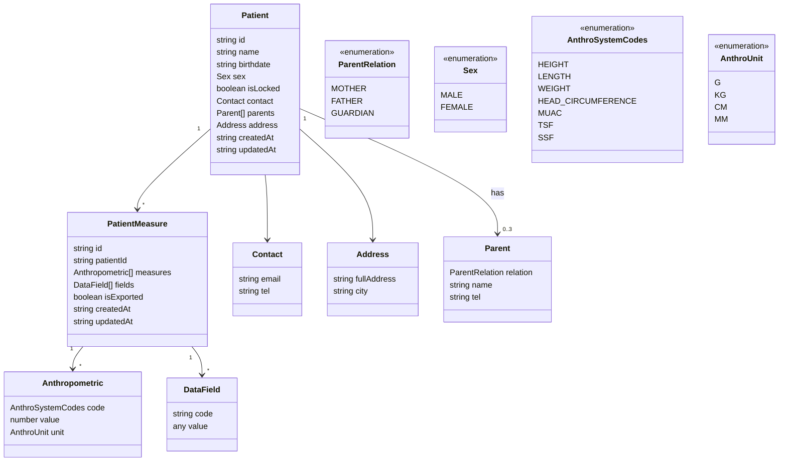

# MalnutriX Collect

## 🎯 Vision
Réduire le temps de consultation des nutritionnistes en permettant aux aides-soignants de collecter les données à l'accueil avant la consultation, puis de transmettre facilement ces informations à l'application MalnutriX dédiée aux nutritionnistes.

## 📊 Contexte

### Problème actuel

- Les nutritionnistes passent 15-20 minutes par patient à saisir les données
- Cela ralentit les consultations
- Des erreurs de saisie fréquentes se produisent

### Solution proposée

Application mobile pour les aides-soignants qui permet de :
1. Collecter les données des patients à l'accueil
2. Transmettre facilement ces informations à l'application MalnutriX via QR code
3. Améliorer l'efficacité des consultations grâce à une transmission fluide des données

### Impact attendu

- Réduction de 90% du temps nécessaire au nutritionniste pour avoir les données dans l'app MalnutriX
- Réduction des erreurs de saisie
- Amélioration de l'expérience patient grâce à des consultations plus rapides

## 🚀 Fonctionnalités principales

- 🔄 Navigation entre les écrans principaux (Dashboard, Ajout/Édition de patient, Import/Export via QR code)
- 👤 Visualisation de la liste des patients avec recherche
- 📋 Formulaire complet pour créer/mettre à jour un patient (nom, sexe, adresse, parents, contact)
- 📏 Formulaire de mesure (poids, taille, etc.) pour chaque patient
- 📲 Synchronisation via WiFi/TCP Socket avec l'application MalnutriX (nutritionniste)
- 📤 Export des patients via séquence de QR codes animés
- 💾 Stockage local hors ligne (MMKV/LegendState)
- 🔐 Verrouillage/déverrouillage des patients
- 📱 Interface responsive avec composants Gluestack UI
- ✅ Validation des formulaires via `valibot`
- 📊 Historique des mesures par patient (déjà implémenté)
- 📏 Scan de codes-barres (déjà implémenté)

## ✅ Statut du développement

🎉 **Version bêta – Fonctionnalités de base implémentées**

### Fonctionnalités implémentées

✅ Navigation de base entre les écrans
✅ Affichage de la liste des patients
✅ Formulaire de création/mise à jour des patients
✅ Synchronisation via WiFi et TCP Socket avec l'application MalnutriX (nutritionniste)
✅ Export des patients via QR codes séquencés (animés)
✅ Gestion des informations complètes (parents, contact, adresse, etc.)
✅ Formulaire de mesure pour les patients (`[id]/patient_measure_form`)
✅ Stockage local hors ligne via LegendState/MMKV
✅ UI Gluestack UI + animations
✅ Validation des formulaires via `valibot`

### Fonctionnalités à implémenter

⬜ Scan de codes-barres
⬜ Historique des mesures par patient (à affiner)
⬜ Gestion multi-utilisateurs (rôles)
⬜ Tests unitaires/intégration

## 🗺️ Roadmap

Pour une vue détaillée de la roadmap, voir le fichier [ROADMAP.md](./ROADMAP.md).

## 🏗️ Architecture technique

### Stack technique

- **Framework** : React Native avec Expo
- **Gestion d'état** : Legend State
- **Navigation** : Expo Router
- **UI Components** : Gluestack UI
- **Animations** : Moti & Reanimated
- **Validation de formulaires** : React Hook Form & Valibot
- **Stockage local** : MMKV
- **QR Code** : react-native-qrcode-svg
- **Styles** : TailwindCSS avec Nativewind

### Schéma de données



## 🔄 Workflow de transmission des données
1. **Collecte** : L'aide-soignant saisit les données du patient dans MalnutriX Collect
2. **Synchronisation** : L'aide-soignant scanne un QR code contenant les informations de connexion (SSID, mot de passe, IP et port) du nutritionniste
3. **Connexion** : MalnutriX Collect se connecte automatiquement au réseau WiFi du nutritionniste et établit une connexion TCP sécurisée
4. **Transfert** : Les données des patients non encore synchronisés sont transférées du collecteur vers l'application du nutritionniste via le protocole TCP
5. **Intégration** : Les données sont automatiquement intégrées dans le dossier du patient et les patients sont verrouillés après synchronisation

## 🛠️ Installation et démarrage

### Prérequis

- Node.js >= 18
- Bun (gestionnaire de paquets)
- Expo CLI

### Installation

```bash
# Cloner le dépôt
git clone https://github.com/nXhermane/MalnutrixCollect.git

# Installer les dépendances
bun install
```

### Développement

```bash
# Démarrer l'application en mode développement
bun start

# Démarrer sur Android
bun android

# Démarrer sur iOS
bun ios

# Démarrer sur Web
bun web
```

### Linting

```bash
# Vérifier le code avec ESLint
bun lint
```

## 📁 Structure du projet

```
src/
├── app/                 # Pages de l'application
├── components/          # Composants réutilisables
├── constants/           # Constantes de l'application
├── models/              # Modèles de données et schémas
├── providers/           # Context providers
├── store/               # Configuration du store global
├── utils/               # Fonctions utilitaires
└── viewModel/           # Logique métier
```
<!-- 
## 👥 Équipe

- **Chef de projet** : Dossou Hermane
- **Dev lead** : nXhermane
- **Nutritionnistes** : Dossou Hermane -->

## 📅 Dates clés

- **Kickoff** : 25 novembre 2025
- **MVP** : 12 décembre 2025
- **Déploiement** : 26 décembre 2025

## 🔗 Liens utiles

- [Repo GitHub](https://github.com/nXhermane/MalnutrixCollect)
- [Documentation pour les aides-soignants](#)