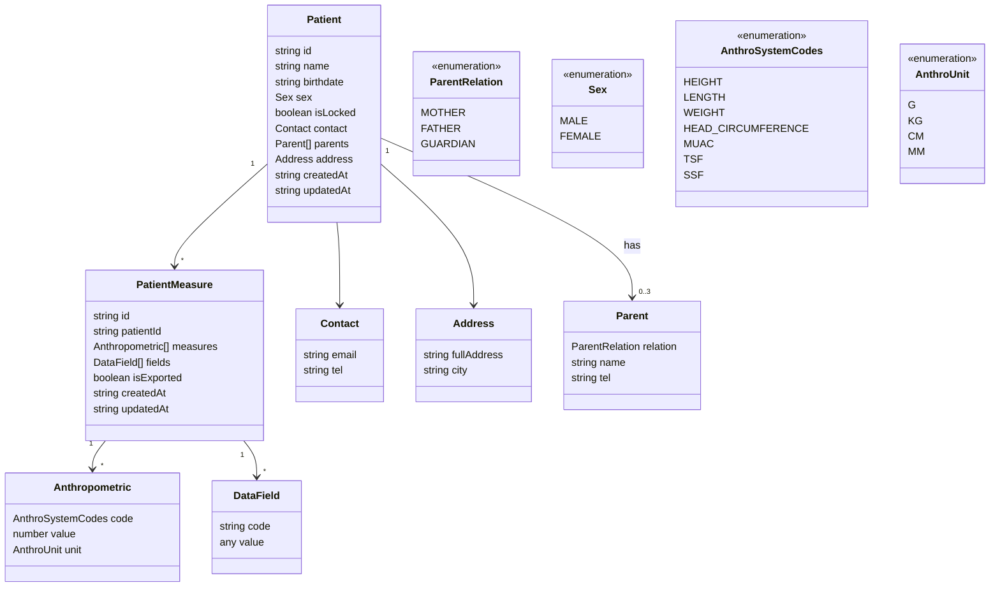

# MalnutriX Collect

## 🎯 Vision
Réduire le temps de consultation des nutritionnistes en permettant aux aides-soignants de collecter les données à l'accueil avant la consultation, puis de transmettre facilement ces informations à l'application MalnutriX dédiée aux nutritionnistes.

## 📊 Contexte

### Problème actuel

- Les nutritionnistes passent 15-20 minutes par patient à saisir les données
- Cela ralentit les consultations
- Des erreurs de saisie fréquentes se produisent

### Solution proposée

Application mobile pour les aides-soignants qui permet de :
1. Collecter les données des patients à l'accueil
2. Transmettre facilement ces informations à l'application MalnutriX via QR code
3. Améliorer l'efficacité des consultations grâce à une transmission fluide des données

### Impact attendu

- Réduction de 90% du temps nécessaire au nutritionniste pour avoir les données dans l'app MalnutriX
- Réduction des erreurs de saisie
- Amélioration de l'expérience patient grâce à des consultations plus rapides

## 🚀 Fonctionnalités principales

- 🔄 Navigation entre les écrans principaux (Dashboard, Ajout de patient, Import/Export via QR code)
- 👤 Visualisation de la liste des patients avec leurs informations de base
- 🔍 Recherche de patients par nom
- 📋 Affichage détaillé d'un patient avec ses mesures
- ➕ Ajout de nouvelles mesures à un patient existant
- 🔐 Verrouillage/déverrouillage des patients
- 📱 Interface responsive avec composants UI modernes
- 📲 Transmission sécurisée des données vers MalnutriX via QR code

## 🚧 Statut du développement

⚠️ **Projet en cours de développement - MVP non terminé**

### Fonctionnalités implémentées

✅ Navigation de base entre les écrans  
✅ Affichage de la liste des patients (avec données statiques de démonstration)  
✅ Affichage détaillé d'un patient  
✅ Ajout de mesures à un patient (interface partielle)  
✅ Scan de QR code pour import de données  
✅ Interface utilisateur avec composants Gluestack UI  

### Fonctionnalités à implémenter

⬜ Enregistrement de nouveaux patients  
⬜ Saisie complète des mesures anthropométriques  
⬜ Partage de patients avec le nutritionniste via QR code  
⬜ Nettoyage des données des patients  
⬜ Scan de codes-barres  
⬜ Historique des mesures par patient  

## 🗺️ Roadmap

### Phase 1 - MVP (En cours)

- [ ] Enregistrement d'un nouveau patient
- [ ] Saisie des mesures anthropométriques (poids, taille, MUAC)
- [ ] Partage de patient avec le nutritionniste via QR code
- [ ] Scanner le code QR pour importer des patients

### Phase 2 - Features avancées

- [ ] Scan de codes-barres
- [ ] Historique des mesures par patient

## 🏗️ Architecture technique

### Stack technique

- **Framework** : React Native avec Expo
- **Gestion d'état** : Legend State
- **Navigation** : Expo Router
- **UI Components** : Gluestack UI
- **Animations** : Moti & Reanimated
- **Validation de formulaires** : React Hook Form & Valibot
- **Stockage local** : MMKV
- **QR Code** : react-native-qrcode-svg
- **Styles** : TailwindCSS avec Nativewind

### Schéma de données



## 🔄 Workflow de transmission des données
1. **Collecte** : L'aide-soignant saisit les données du patient dans MalnutriX Collect
2. **Transmission** : Les données sont encodées dans un QR code
3. **Réception** : Le nutritionniste scanne le QR code avec MalnutriX
4. **Intégration** : Les données sont automatiquement intégrées dans le dossier du patient

## 🛠️ Installation et démarrage

### Prérequis

- Node.js >= 18
- Bun (gestionnaire de paquets)
- Expo CLI

### Installation

```bash
# Cloner le dépôt
git clone https://github.com/nXhermane/MalnutrixCollect.git

# Installer les dépendances
bun install
```

### Développement

```bash
# Démarrer l'application en mode développement
bun start

# Démarrer sur Android
bun android

# Démarrer sur iOS
bun ios

# Démarrer sur Web
bun web
```

### Linting

```bash
# Vérifier le code avec ESLint
bun lint
```

## 📁 Structure du projet

```
src/
├── app/                 # Pages de l'application
├── components/          # Composants réutilisables
├── constants/           # Constantes de l'application
├── models/              # Modèles de données et schémas
├── providers/           # Context providers
├── store/               # Configuration du store global
├── utils/               # Fonctions utilitaires
└── viewModel/           # Logique métier
```
<!-- 
## 👥 Équipe

- **Chef de projet** : Dossou Hermane
- **Dev lead** : nXhermane
- **Nutritionnistes** : Dossou Hermane -->

## 📅 Dates clés

- **Kickoff** : 25 novembre 2025
- **MVP** : 10 décembre 2025
- **Déploiement** : 26 décembre 2025

## 🔗 Liens utiles

- [Repo GitHub](https://github.com/nXhermane/MalnutrixCollect)
- [Documentation pour les aides-soignants](#)