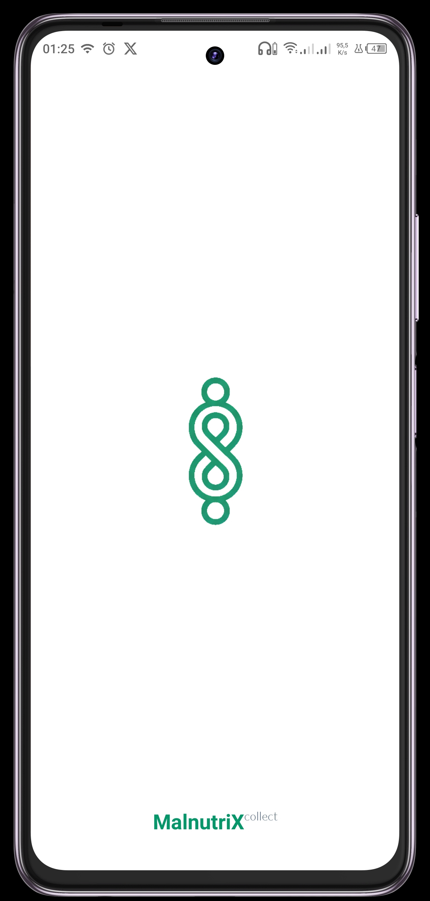
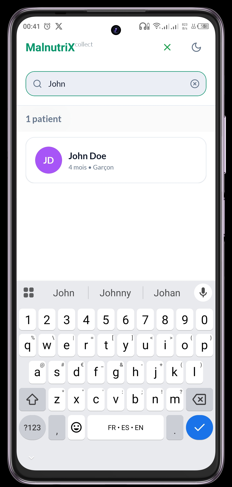
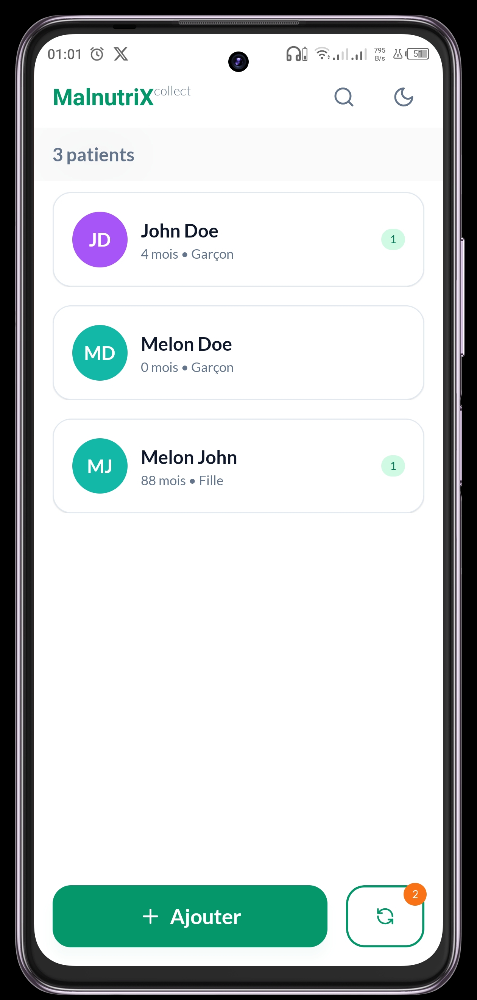
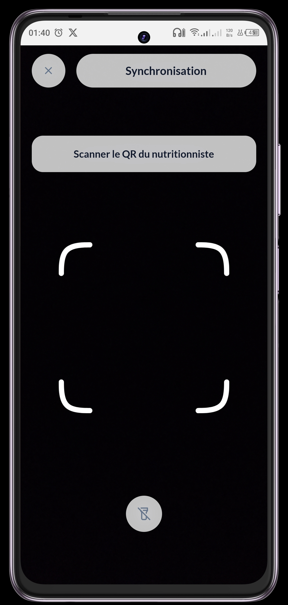

# Guide Utilisateur de MalnutriX Collect

Bienvenue sur le guide de l'application **MalnutriX Collect**. Ce document est destiné aux aides-soignants et a pour but de les guider à chaque étape de l'utilisation de l'application.

## 📋 Table des matières

1. [Introduction](#introduction)
2. [Processus de Prise en Charge & Utilisation de l'App](#-processus-de-prise-en-charge--utilisation-de-lapp)
   - [Étape 1 : Accueil et Identification](#étape-1--accueil-et-identification)
   - [Étape 2 : Mesures Anthropométriques et Cliniques](#étape-2--mesures-anthropométriques-et-cliniques)
   - [Étape 3 : Transmission et Finalisation (Synchronisation)](#étape-3--transmission-et-finalisation-synchronisation)

---

## Introduction

**MalnutriX Collect** est une application mobile conçue pour simplifier la collecte des données des patients avant leur consultation. Elle permet de saisir les informations administratives, les mesures anthropométriques et les signes cliniques de manière structurée pour gagner du temps et réduire les erreurs.

---

## 🏥 Utilisation de l'App

Voici comment l'application s'intègre dans votre travail quotidien.

### Étape 1 : Accueil et Identification

**Action :** Recevoir le parent et l'enfant, puis identifier le patient.

1. **Recherche d'un patient :**
   - Utilisez la **barre de recherche** en haut pour trouver un patient par son nom.
   - Si le patient existe, appuyez sur son nom pour voir sa fiche.
     
2. **Création d'un nouveau patient :**
   - Si le patient n'existe pas, appuyez sur le bouton **"Ajouter"** en bas de l'écran.

3. **Remplir le formulaire :**
   - **Informations personnelles :** Nom complet, date de naissance, sexe.
   - **Informations de contact :** Numéro de téléphone, email.
   - **Adresse :** Adresse complète et ville.
   - **Parents / Tuteurs :** Saisissez les informations du père, de la mère ou du tuteur.

   - Une fois terminé, appuyez sur **"Ajouter un nouveau patient"**.

   _Note : Une fois les informations nécessaires saisies, vous pouvez ajouter un nouveau patient sinon le bouton d'ajout reste désactivé._
   

[🎥 Cliquez ici pour voir la vidéo de démonstration](https://img.youtube.com/vi/2aF0BKlBcpo/mqdefault.jpg) [https://youtube.com/shorts/2aF0BKlBcpo](https://youtube.com/shorts/2aF0BKlBcpo)

---

### Étape 2 : Mesures Anthropométriques et cliniques

**Action :** Prendre les mesures de l'enfant (Poids, Taille, MUAC) et vérifier l'état de santé.

1. Allez sur la fiche du patient en appuyant sur son nom.
2. Appuyez sur le bouton **"Nouvelle visite"**.
3. Saisissez les données mesurées :
   - **Poids**
   - **Taille**
   - **Périmètre Brachial (MUAC)**
   - **Œdèmes :** Cochez la case si vous observez des œdèmes.
   - **Signes cliniques :** Température et autres informations.

[🎥 Cliquez ici pour voir la vidéo de démonstration](https://img.youtube.com/vi/Z4VxHpO7ilk/mqdefault.jpg) [https://youtube.com/shorts/Z4VxHpO7ilk](https://youtube.com/shorts/Z4VxHpO7ilk)

4. Validez pour enregistrer la visite.

---

### Étape 3 : Transmission et Finalisation (Synchronisation)

**Action :** Transférer numériquement le dossier au nutritionniste.

_Note : Une fois les données envoyées, les informations administratives sont automatiquement verrouillées et ne peuvent plus être modifiées._

1. Sur l'écran d'accueil, appuyez sur le bouton de **Synchronisation** (icône avec des flèches circulaires).
   - Le badge indique le nombre de patients en attente d'envoi.

     

2. L'appareil photo s'ouvre : **scannez le QR code** affiché sur l'application du nutritionniste.

   

3. Une fois le scan réussi, les données sont transmises. Un message de succès vous confirmera la fin de l'opération.

_Note :La synchronisation permet également au nutritioniste de vous envoyer une liste de patients déjà enregistrés auxquels vous pouvez ajouter des visites(des mesures anthropométriques et des informations cliniques)._

---
